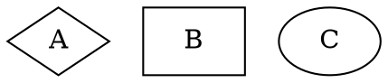
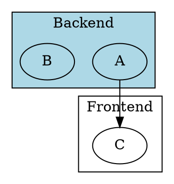
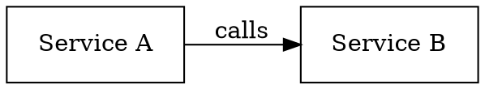
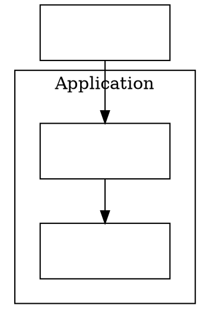

# DOT Language Reference

## Grammar

```
[strict] (graph | digraph) [ID] { stmt_list }
```

- `digraph` — directed graph; edges use `->`, arrowheads rendered by default
- `graph` — undirected; edges use `--`
- `strict` — prevents parallel edges between the same node pair (multi-edges collapsed)

## Statement types

```dot
// 1. Node declaration
node_id [attr_list]

// 2. Edge declaration
node_or_subgraph -> node_or_subgraph [attr_list]   // digraph
node_or_subgraph -- node_or_subgraph [attr_list]   // graph

// 3. Attribute defaults (cascade to subsequently-defined objects)
graph [key=value ...]
node  [key=value ...]
edge  [key=value ...]

// 4. Subgraph / cluster
subgraph [ID] { stmt_list }

// 5. Variable assignment (rarely needed)
ID = ID
```

Semicolons and commas between statements are optional whitespace.

## IDs

| Form | Example | Notes |
|------|---------|-------|
| Alphanumeric | `myNode`, `_x1` | Cannot start with digit |
| Numeral | `3.14`, `-1` | Optional sign/decimal |
| Double-quoted | `"hello world"`, `"it's \"ok\""` | Escape `"` with `\` |
| HTML string | `<B>bold</B>` | Angle brackets, valid XML required |

## Nodes

```dot
A                           // declare with no attributes
B [label="Box B" shape=box] // with attributes
"my node" [width=1.5]       // quoted ID
```

Default `label` for nodes is `\N` (the node ID). To show no label: `label=""`.

## Edges

```dot
A -> B                       // simple directed edge
A -> B [label="x" weight=2]  // with attributes
A -> {B C D}                 // fan-out: creates A→B, A→C, A→D
{A B} -> C                   // fan-in
A -> B -> C                  // chain
```

## Attribute scoping

Attribute defaults apply to objects declared **after** the statement, not before.



## Subgraphs and clusters

Subgraphs group nodes for three purposes:
1. **Shared attribute context** — set defaults for contained nodes/edges
2. **Edge shorthand** — `{A B} -> C` means two edges
3. **Layout hint** — if the name starts with `cluster`, graphviz treats it specially

**Cluster convention (critical):**

A subgraph whose name starts with `cluster` is drawn with a bounding rectangle around its contents. The `cluster_` prefix is a naming convention, not a keyword.



Cluster nodes have no `pos` in JSON output — use the `bb` bounding box instead. See `json-output.md`.

## Ports and compass points

Edges can attach to specific sides of a node:

```dot
A:n -> B:s        // A north → B south
A:port1 -> B      // named port
A:port1:ne -> B   // named port + compass point
```

Compass points: `n`, `ne`, `e`, `se`, `s`, `sw`, `w`, `nw`, `c` (center), `_` (default).

## HTML labels

Use `<...>` for HTML-like table labels (not supported in all renderers):

```dot
A [label=<<TABLE><TR><TD>Row 1</TD></TR></TABLE>>]
```

Useful for multi-cell nodes and rich formatting.

## Comments

```dot
// C++ line comment
/* C block comment */
# Shell-style (Graphviz only)
```

## Minimal working examples

**Directed graph:**


**With cluster:**


> **`compound=true`** must be set on the root graph for edges to connect across cluster boundaries (e.g. `lhead=cluster_app`). Without it, inter-cluster edges are ignored.
