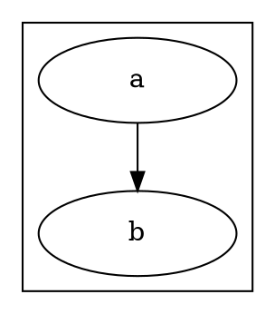

# Graphviz JSON Output (`-Tjson`)

Invoke with: `dot -Tjson -Kdot` (or `-Kneato` etc.) reading DOT from stdin.

All coordinate values are in **points** (72pt/inch). The Y-axis origin is **bottom-left** (Y increases upward). To convert to screen pixels with 96dpi display:

```
x_px = x_pt  * (96/72)
y_px = (totalHeight_pt - y_pt) * (96/72)   // flip Y axis
```

`totalHeight_pt` = `bb.ury` from the root graph's `bb` field.

---

## Top-level structure

```json
{
  "name": "G",
  "directed": true,
  "strict": false,
  "_subgraph_cnt": 2,
  "bb": "0,0,432,216",
  "objects": [ ... ],
  "edges": [ ... ]
}
```

| Field | Type | Notes |
|-------|------|-------|
| `name` | string | Graph ID from the DOT source |
| `directed` | bool | `true` for digraph |
| `strict` | bool | `true` if `strict` keyword used |
| `_subgraph_cnt` | int | Number of subgraphs (including clusters) |
| `bb` | string | Root bounding box: `"llx,lly,urx,ury"` in points |
| `objects` | array | All subgraphs and nodes (see below) |
| `edges` | array | All edges (see below) |

---

## `bb` bounding box format

`"llx,lly,urx,ury"` — lower-left x, lower-left y, upper-right x, upper-right y — all in **points**.

For the root graph, `lly` is typically `0`, and `ury` is the total height. This `ury` value is `totalHeight_pt` used in Y-flip conversions.

```js
const bb = "0,0,576,288".split(",").map(parseFloat);
// { llx: 0, lly: 0, urx: 576, ury: 288 }
const totalH = bb[3]; // 288 pt
```

---

## `objects` array — nodes

Each node object:

```json
{
  "_gvid": 3,
  "name": "svc-a",
  "label": "Service A",
  "pos": "144,108",
  "width": "1.5",
  "height": "0.625"
}
```

| Field | Notes |
|-------|-------|
| `_gvid` | Index in `objects` array (0-based); used as `tail`/`head` in edges |
| `name` | Node ID as written in DOT source |
| `label` | Rendered label text |
| `pos` | Center position: `"x,y"` in points |
| `width` | Width in **inches** (not points!) |
| `height` | Height in **inches** |

**Converting node center to top-left pixel origin:**
```js
const pos = "144,108".split(",").map(parseFloat);
const w   = parseFloat("1.5") * 96;    // inches → pixels
const h   = parseFloat("0.625") * 96;
const x   = pos[0] * (96/72) - w / 2; // center → left edge
const y   = (totalH - pos[1]) * (96/72) - h / 2; // flip + center → top edge
```

---

## `objects` array — clusters

Clusters appear in `objects` with their `name` starting with `cluster_`:

```json
{
  "_gvid": 0,
  "name": "cluster_app",
  "bb": "36,36,270,180",
  "label": "Application",
  "nodes": [1, 2],
  "edges": []
}
```

| Field | Notes |
|-------|-------|
| `name` | `"cluster_<id>"` |
| `bb` | Bounding box `"llx,lly,urx,ury"` in points; may be absent for neato/fdp clusters |
| `nodes` | Array of `_gvid` indices for member nodes |
| `subgraphs` | Array of `_gvid` indices for nested subgraphs |

**Converting cluster bb to pixel rect:**
```js
const p = "36,36,270,180".split(",").map(parseFloat);
// p = [llx, lly, urx, ury] in points
const x = p[0] * PT2PX;
const y = (totalH - p[3]) * PT2PX;  // ury → top edge (Y-flip)
const w = (p[2] - p[0]) * PT2PX;
const h = (p[3] - p[1]) * PT2PX;
```

**Cluster `bb` availability:** dot emits `bb` for clusters reliably. neato/fdp may omit it — derive cluster bounds from member node positions in that case.

---

## `edges` array

```json
{
  "_gvid": 0,
  "tail": 1,
  "head": 2,
  "pos": "e,216,126 108,108 144,126 180,126 216,126",
  "lp": "162,144",
  "attrs": { "eid": "edge-42" }
}
```

| Field | Notes |
|-------|-------|
| `_gvid` | Edge index |
| `tail` | `_gvid` of source node/cluster object |
| `head` | `_gvid` of destination node/cluster object |
| `pos` | Spline control points (see below) |
| `lp` | Label center position: `"x,y"` in points; present only if `label` or `xlabel` was set |
| `attrs` | Object containing custom attributes set on the edge in DOT source (e.g. `eid`) |

---

## Edge `pos` — spline notation

Format: `"[e,ex,ey ][s,sx,sy ]x0,y0 x1,y1 x2,y2 x3,y3 [x4,y4 x5,y5 x6,y6 ...]"`

- **`e,ex,ey`** — optional: the actual arrow **endpoint** (tip of arrowhead). Prefixed with `e,`.
- **`s,sx,sy`** — optional: the actual arrow **startpoint**. Prefixed with `s,`.
- **Control points:** the remaining space-separated `x,y` pairs are cubic Bézier control points, always in groups of 4: `P0 P1 P2 P3` per segment. Total points = `1 + 3N` for `N` segments.

```
e,ex,ey  P0 P1 P2 P3 [P4 P5 P6 ...]
│         │  └─┬─┘   └──── segment 2 ────
│         │    └── segment 1 control pts
│         └── segment 1 start = overall spline start
└── arrow endpoint (after stripping "e," prefix)
```

**Parsing steps:**
1. Strip the `e,ex,ey` prefix (and `s,sx,sy` if present) — split on first space after `e,`.
2. Split remaining string on whitespace.
3. Parse each token as `x,y` floats.
4. Apply coordinate transform to each: `x_px = x_pt * PT2PX`, `y_px = (totalH - y_pt) * PT2PX`.
5. For Bézier curves: take points in groups of 4; sample each segment with `t ∈ [0,1]`.
6. For polyline: every 3rd point (index 3, 6, 9...) is a corner — use as bendpoints.

```js
// Strip e, prefix
let s = posStr.trim();
if (s.startsWith("e,")) s = s.substring(s.indexOf(" ") + 1);
if (s.startsWith("s,")) s = s.substring(s.indexOf(" ") + 1);

const pts = s.trim().split(/\s+/).map(tok => {
  const [x, y] = tok.split(",").map(parseFloat);
  return { x: x * PT2PX, y: (totalH - y) * PT2PX };
});
// pts[0] = start; pts[1..3] = first segment control pts; pts[3] = end of seg 1 = start of seg 2, etc.
```

**Cubic Bézier sampling (N points per segment):**
```js
for (let t = 1; t < N; t++) {
  const u = t / N, m = 1 - u;
  bps.push({
    x: m*m*m*P0.x + 3*m*m*u*P1.x + 3*m*u*u*P2.x + u*u*u*P3.x,
    y: m*m*m*P0.y + 3*m*m*u*P1.y + 3*m*t*u*P2.y + u*u*u*P3.y,
  });
}
```

**Polyline/ortho corner extraction:**
For non-Bézier spline types, the corner points are at indices 3, 6, 9, … (every 3rd point after the start). The intermediate control points don't represent visible bends.

---

## Walking the objects array

The `objects` array mixes nodes and cluster subgraphs. Distinguish them by:
- Cluster: `obj.name.startsWith("cluster_")` — use `obj.bb`
- Node: has `obj.pos` and name does not start with `cluster_`

To recurse nested clusters, follow `obj.subgraphs` (array of `_gvid` indices into `objects`).

```js
function walk(obj, objects, totalH, nodes, clusters) {
  const name = String(obj.name || "");
  if (name.startsWith("cluster_") && obj.bb) {
    const id = name.slice("cluster_".length);
    const p  = obj.bb.split(",").map(parseFloat);
    clusters[id] = { x: p[0]*PT2PX, y: (totalH-p[3])*PT2PX,
                     w: (p[2]-p[0])*PT2PX, h: (p[3]-p[1])*PT2PX };
  } else if (obj.pos && !name.startsWith("cluster_")) {
    const [x, y] = obj.pos.split(",").map(parseFloat);
    const w = parseFloat(obj.width)  * 96;
    const h = parseFloat(obj.height) * 96;
    nodes[name] = { x: x*PT2PX - w/2, y: (totalH-y)*PT2PX - h/2, w, h };
  }
  if (obj.objects) obj.objects.forEach(sub => walk(sub, objects, totalH, nodes, clusters));
}
```

---

## Annotated sample

DOT input:


JSON output (simplified):
```json
{
  "bb": "0,0,288,144",
  "objects": [
    { "_gvid": 0, "name": "cluster_app", "bb": "18,18,198,126" },
    { "_gvid": 1, "name": "a", "pos": "72,72",  "width": "1.458", "height": "0.625" },
    { "_gvid": 2, "name": "b", "pos": "144,72", "width": "1.458", "height": "0.625" }
  ],
  "edges": [
    {
      "_gvid": 0, "tail": 1, "head": 2,
      "pos": "e,126,72 90,72 98,72 107,72 126,72",
      "attrs": { "eid": "e1" }
    }
  ]
}
```

With `totalH = 144`, `PT2PX = 96/72 = 1.333`:
- Node "a" center: `(72×1.333, (144-72)×1.333)` = `(96px, 96px)`; top-left: `(96-93.3/2, 96-40/2)` ≈ `(49, 76)`
- Cluster "app": `x=18×1.333=24`, `y=(144-126)×1.333=24`, `w=180×1.333=240`, `h=108×1.333=144`
